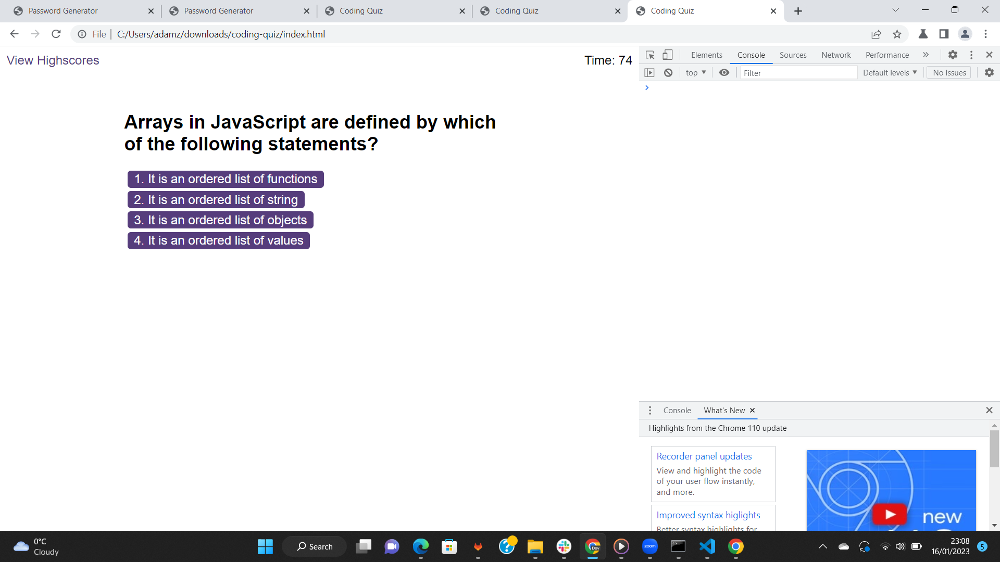

# Code Quiz

## Description

A timed coding quiz with multple-chooice questions with updated HTML and CSS powered by JavaScript code. 

## Installations
A quiz page that is functional when deployed onto the URL and has the following features:

* A start button that displays the first question when clicked and a timer starts.
 
* Questions contain buttons for each answer.
* 
* When answer is clicked, the next question appears
* 
* When the answer clicked is incorrect then 1time is subtracted from the clock

* The quiz ends when all questions are answered or the timer reaches 0.

* When the game ends, it  displays their score and give the user the ability to save their initials and their score
* Application loads without error.
  
  
## Screenshot and Animation

The following animation demonstrates the application functionality:

